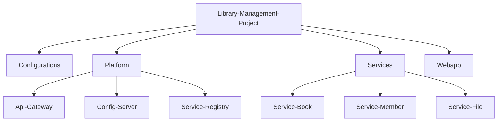

# Library Management System - Microservices Architecture

Welcome to the Library Management System! This project is a comprehensive, scalable application built using a microservices architecture. It leverages a nested polyrepo structure to organize the various components, services, and configuration files efficiently.

## Project Architecture

The system is divided into several independent domains, grouped logically into nested submodules.

### Main Repository Structure

This parent repository ties together four main domains of the application:
1.  **Configurations**: Centralized configuration properties and environments for the microservices.
2.  **Platform**: The foundational infrastructure components required to run the microservices ecosystem.
3.  **Services**: The core business logic microservices.
4.  **Webapp**: The frontend user interface for interacting with the system.

### Nested Submodules Breakdown

To maintain strict modularity and separation of concerns, the `Platform` and `Services` repositories contain nested submodules representing their specific individual components.



### Component Details

#### Platform Components
-   **API Gateway**: The single entry point for all client requests, routing them to the appropriate backend microservices and handling cross-cutting concerns.
-   **Config Server**: Provides centralized configuration management across all environments for the distributed system.
-   **Service Registry**: A discovery server that allows microservices to register themselves and discover other services dynamically at runtime.

#### Core Services
-   **Book Service**: Manages the catalog of books, including adding, updating, tracking inventory, and retrieving book information.
-   **Member Service**: Handles user management, library memberships, tracking, and basic authentication/authorization checks.
-   **File Service**: Manages unstructured data, file uploads, and attachment resources associated with books or members (e.g. cover images, profile pictures).

## Getting Started

### Prerequisites
- Git

### Cloning the Repository

Because this project uses a nested polyrepo structure via Git submodules, you **must** use the `--recurse-submodules` flag when cloning the repository to ensure all nested components down the tree are downloaded correctly:

```bash
git clone --recurse-submodules https://github.com/DilsaraThiranjaya/Library-Management-Project.git
```

If you have already cloned the repository normally and your submodule folders are empty, you can initialize and update them by running:

```bash
git submodule update --init --recursive
```

## Development and Contribution

Each component operates in its own independent repository and can be developed, built, and tested in isolation. 

To make changes to a specific service or platform component:
1. Navigate to its respective directory.
2. Ensure you are on the `main` branch or a feature branch within that component.
3. Make your changes and commit them directly to that component's repository.
4. If necessary, navigate back to the main repository to update the submodule reference to the latest commit.